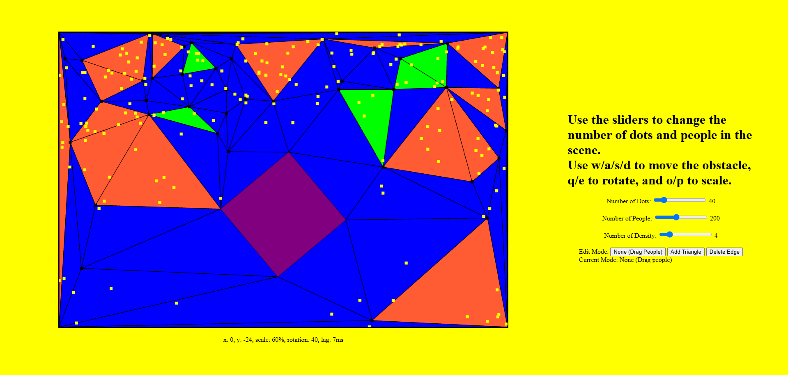
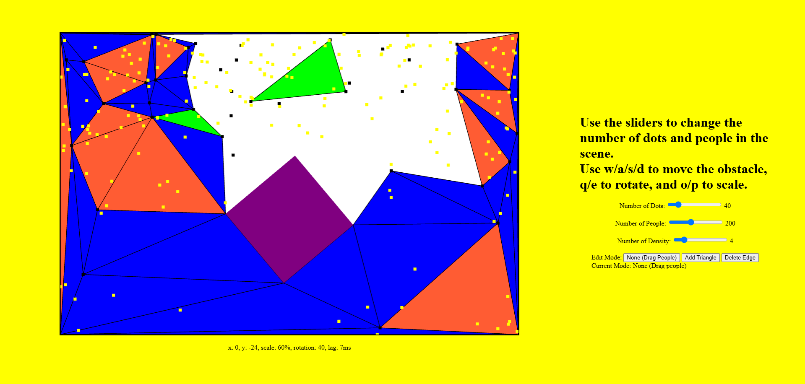

# WebGL 2D Crowd Simulation Renderer

This project is a 2D crowd simulation renderer built using WebGL and plain JavaScript. It visualizes a partitioned space with a movable obstacle, a set of triangulation points ("dots"), and a population of "people". The simulation dynamically recalculates the triangulation and visualizes population density across different regions in real-time.

This application was developed as a solution for the Programming Assignment 1 for the course **CS606: Computer Graphics**.

## Features

This project implements a variety of features required for a 2D crowd simulation, focusing on real-time interactivity and WebGL rendering.

- **Dynamic Scene Generation**: The application initializes with a random distribution of "dots" (for triangulation) and "people" within a defined space.
- **Constrained Delaunay Triangulation**: The 2D space is partitioned into triangles using the `cdt2d` library. A central obstacle is integrated as a constraint, ensuring its edges are part of the triangulation mesh.
- **Interactive Obstacle**: Users can manipulate a central obstacle in real-time:
  - **Translation**: Move the obstacle up, down, left, or right.
  - **Rotation**: Rotate the obstacle around its center.
  - **Scaling**: Scale the obstacle uniformly up or down.
- **Real-time Triangulation Updates**: Any transformation applied to the obstacle automatically triggers a recalculation of the triangulation mesh to adapt to the new layout.
- **Population Density Visualization**: Triangles are color-coded based on the number of "people" they contain, providing an immediate visual representation of crowd density.
  - **Blue**: Underpopulated (below the density threshold).
  - **Green**: Correctly populated (at the density threshold).
  - **Red**: Overpopulated (above the density threshold).
- **Collision Handling**: People and dots that collide with the obstacle are removed and regenerated in valid, non-colliding locations.
- **Interactive Mesh Editing**: The triangulation mesh can be manually edited:
  - **Add Triangle**: Users can select three vertices (dots or corners) to manually create a new triangle.
  - **Delete Edge**: Users can click on an existing edge to remove it from the triangulation.
- **Interactive Crowd Movement**: Individual "people" can be clicked and dragged to new locations, which updates the density coloring of the affected triangles.
- **Dynamic Controls**: Sliders allow for real-time adjustment of the number of dots, the number of people, and the population density threshold.




## Controls

### Obstacle Manipulation

| Key | Action                            |
| :-- | :-------------------------------- |
| `W` | Move Obstacle Up                  |
| `S` | Move Obstacle Down                |
| `A` | Move Obstacle Left                |
| `D` | Move Obstacle Right               |
| `Q` | Rotate Obstacle Counter-Clockwise |
| `E` | Rotate Obstacle Clockwise         |
| `O` | Scale Obstacle Up                 |
| `P` | Scale Obstacle Down               |

### Simulation Parameters (UI Sliders)

- **Number of Dots**: Controls the number of vertices used for generating the triangulation mesh.
- **Number of People**: Controls the total number of people (yellow points) in the simulation.
- **Density**: Sets the threshold for determining if a triangle is underpopulated, correctly populated, or overpopulated.

### Interaction Modes (UI Buttons)

- **None (Drag People)**: The default mode. Click and drag any yellow "person" point to a new location.
- **Add Triangle**: Click on three vertices (black dots or corners) in sequence to form and add a new triangle to the mesh.
- **Delete Edge**: Click near any edge of a triangle to delete it. The associated triangles will be removed.

## How to Run Locally

This project uses ES6 modules, which requires it to be run from a local web server to function correctly.

1. **Clone the repository or download the source files.**

   ```bash
   git clone https://github.com/gathik-jindal/2D-Crowd-Simulation-Renderer.git
   ```

2. **Navigate to the project directory.**

   ```bash
   cd 2D-Crowd-Simulation-Renderer
   ```

3. **Start a local web server.** A simple way is to use Python's built-in HTTP server.

   - If you have Python 3:

     ```bash
     python -m http.server
     ```

   - If you have Python 2:

     ```bash
     python -m SimpleHTTPServer
     ```

   Alternatively, you can use a development tool like the [Live Server extension for VS Code](https://marketplace.visualstudio.com/items?itemName=ritwickdey.LiveServer).

4. **Open your web browser** and navigate to the local server's address (e.g., `http://localhost:8000`).

## Project Structure

The project is organized into several JavaScript modules to separate concerns.

- `index.html`: The main HTML file that sets up the canvas and UI controls.
- `index.js`: The core application logic. It initializes WebGL, manages the render loop, handles user input, and coordinates all other modules.
- `math.js`: Contains the key computational logic, including collision detection, triangulation, density calculation, and mesh manipulation functions.
- `utility.js`: Provides utility functions for handling keyboard-driven obstacle transformations (movement, rotation, scaling) and clamping it within bounds.
- `draw-scene.js`: A generic module for drawing objects in WebGL. It sets up shader attributes and executes the appropriate draw calls.
- `init-buffers.js`: Helper functions for creating and initializing WebGL buffers (position, color, indices).
- `gl-utility.js`: Low-level WebGL helper functions for shader compilation and linking, and for updating buffer data.
- `DOM.js`: Contains functions for interacting with the HTML DOM, such as handling slider inputs and converting mouse coordinates.

## Dependencies

This project relies on two external libraries included via CDN:

- **gl-matrix**: A JavaScript library for high-performance vector and matrix math.
- **cdt2d**: A library for performing 2D Constrained Delaunay Triangulation.
